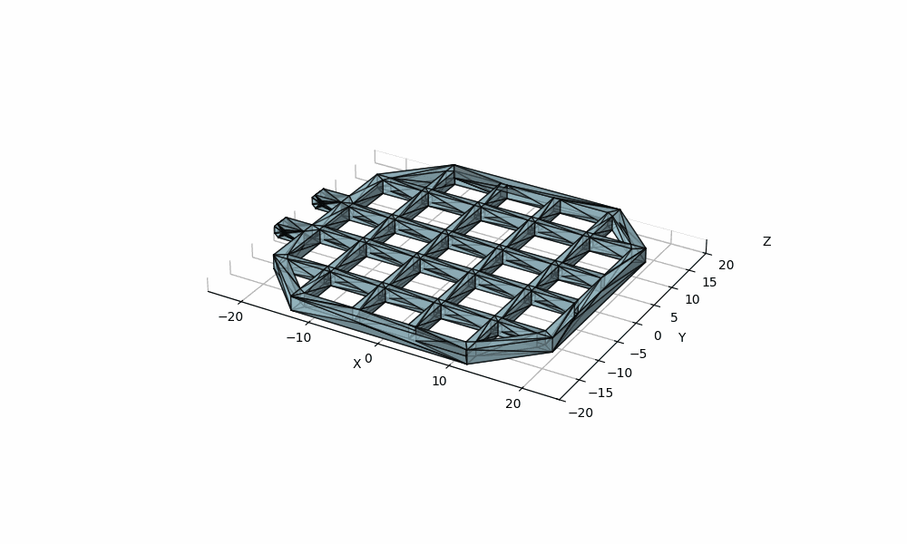
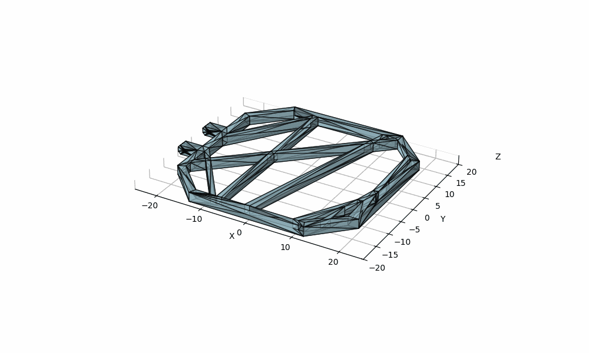
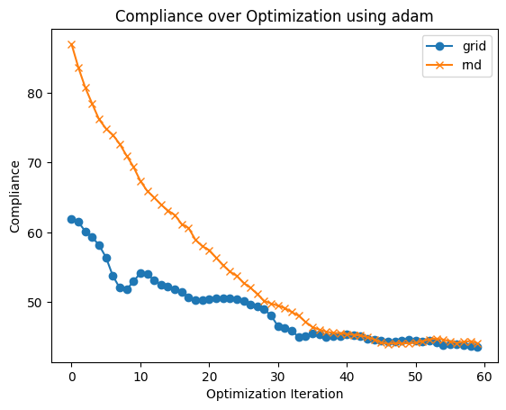

# ANSYS Tesseract Integration

This directory contains an example Tesseract configuration and scripts demonstrating how to use Tesseract-JAX with ANSYS spaceclaim and PyMAPDL. The overall workflow is illustrated below:


The main entry point of this demo is `optimization.ipynb`. The evolution of the mesh over the optimization on two different initial conditions can be seen here:

| Grid IC | Random IC |
|----------|----------|
|     |      |

where the loss decay is plotted here:


## Get Started

### Prerequisites

A windows machine A with:
1. ANSYS installed and an active license.
2. Python and a python environment (e.g., conda, venv).
3. Two open ports.
4. Known IP address, obtain it by running

```powershell
(Get-NetIPAddress -AddressFamily IPv4 -InterfaceAlias "Wi-Fi","Ethernet" | Where-Object {$_.IPAddress -notlike "169.254.*" -and $_.IPAddress -ne $null}).IPAddress
```

A machine B, ideally running linux, with:
1. Docker installed and running.
2. Python and a python environment (e.g., conda, venv).

### SpaceClaim Tesseract setup

In windows powerhsell, install the the required depencencies by running

```bash
pip install tesseract-core[runtime] trimesh
```

Clone this repository, navigate to the `demo/showcase/ansys-shapeopt/spaceclaim_tess` and start the Tesseract runtime server with:

```bash
tesseract-runtime serve --port <port_number_1> --host 0.0.0.0
```
Note that we dont build a Tesseract image for SpaceClaim in this example. This is because SpaceClaim cannot be installed in a containerized environment. More details about this tesseract can be found [here](https://docs.pasteurlabs.ai/projects/tesseract-core/latest/content/examples/ansys_integration/spaceclaim_tess.html).

### PyMAPDL Server

On machine A, run the following Powershell command to start Ansys with gRPC server enabled:

```powershell
Start-Process -FilePath "F:\ANSYS Inc\v242\ansys\bin\winx64\ANSYS242.exe" -ArgumentList "-grpc", "-port", "<port_number_2>"
```

replace "v242" with your ansys version and ensure the path is correct. More details about this tesseract can be found [here](https://docs.pasteurlabs.ai/projects/tesseract-core/latest/content/examples/ansys_integration/pymapdl_tess.html).

### Building Tesseracts

The following commands are also available inside the optimization.ipynb. Therefore at this stage you are ready to run the notebook.

On machine B, navigate to `demo/_showcase/ansys-shapeopt/` and run

```bash
pip install -r requirements.txt
```

and build the needed tesseracts using

```bash
tesseract build spaceclaim
tesseract build pymapdl
tesseract build sdf_fd
```
