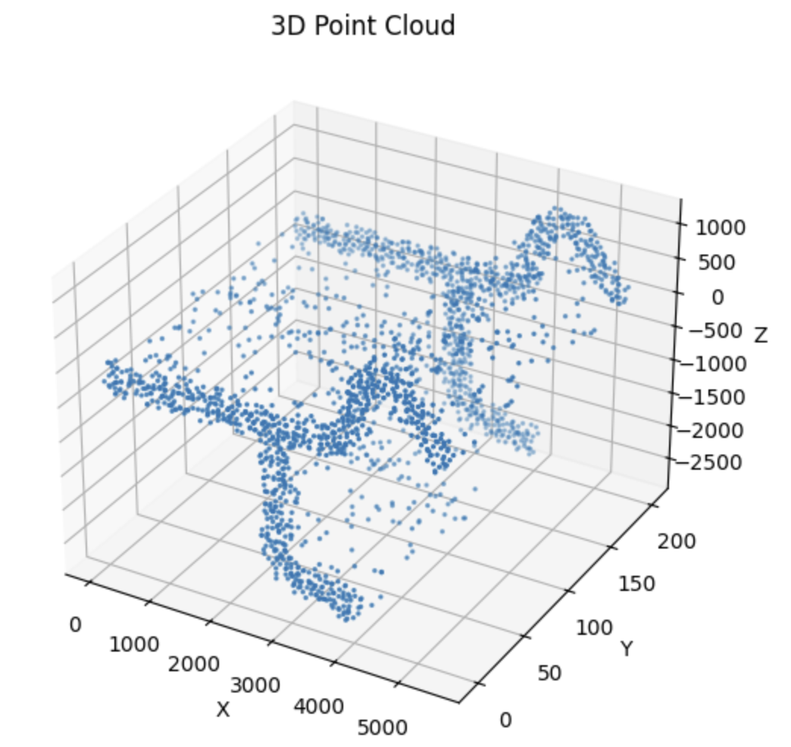
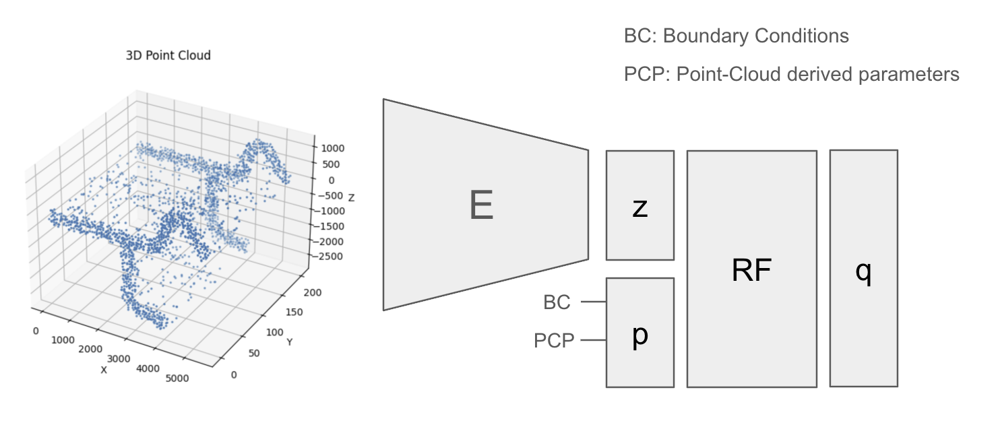

# Ansys <-> Tesseract: Exploring QoI Workflows

## Table of Contents

[1. Case Study: HVAC Duct Dataset](#1-case-study-hvac-duct-dataset)
   - [1.1. Dataset Variations](#11-dataset-variations)
   - [1.2. QoI](#12-qoi)
   - [1.3. Dataset Summary](#13-dataset-summary)

[2. QoI Workflows](#2-qoi-workflows)
   - [2.1. CAD geometries + boundary conditions → QoI-based surrogacy](#21-cad-geometries--boundary-conditions--qoi-based-surrogacy)
   - [2.2. CAD geometries + boundary conditions → Full-field surrogacy → QoI](#22-cad-geometries--boundary-conditions--full-field-surrogacy--qoi)

[3. Ansys↔Tesseract QoI Workflow Proposal](#3-ansystesseract-qoi-workflow-proposal)
   - [3.1. Tesseract Components and Workflows](#31-tesseract-workflows-and-components)
     - [3.1.1. Tesseract Components](#311-tesseract-components)
     - [3.1.2. Tesseract Training Workflow](#312-tesseract-training-workflow)
     - [3.1.3. Tesseract Inference Workflow](#313-tesseract-inference-workflow)

[4. Results](#4-results)

[5. Outlook](#5-outlook)

[Appendix](#appendix)
- [A. QoI-based Surrogate Model](#a-qoi-based-surrogate-model)
  - [A.1. Dataset Preparation](#a1-dataset-preparation)
  - [A.2. Model Architecture](#a2-model-architecture)

Engineers iterate over their designs to meet specific requirements, which are metrics that translate directly into product performance or business needs. We call these metrics Quantities of Interest (QoI). In many engineering contexts, engineers extract QoI as post-processed metrics from simulation solutions. For example, CFD simulations of a wing compute lift and drag coefficients as QoI. Engineering workflows involve iterative updates over design variables (like CAD parameters and boundary conditions) to achieve the required design performance.

This showcase demonstrates how Tesseract and Ansys Fluent work together to extract insights from datasets of numerical simulations with QoI-based surrogacy. In particular, we will cover:
1. How to assemble an internal aerodynamics dataset, based on Ansys simulations, mapping CAD parameters and boundary conditions to QoI.
2. How to create and analyze QoI-based surrogate models built on top of Ansys datasets, eliminating the need for time-consuming simulations
3. How to modularize and execute QoI-based workflows with Tesseracts that integrate with Ansys Fluent simulations outputs

## 1. Case Study: HVAC Duct Dataset
Prior to defining a QoI-based workflow, we created an internal aerodynamics dataset of ~300 samples with Ansys Fluent. This use case consisted of numerical simulations of internal air flow through an HVAC duct with two inner baffle plates. As the image below shows:


- One baffle place is located just after the inlet acting as a flow constrainer
- The second baffle plate is in the intersection between duct branches and redirects the inlet flow

### 1.1 Dataset Variations

**CAD parameters**

Four geometric parameters were modified to explore different duct configurations:
- `d13`: Angle between duct branches
- `d34`: Curvature angle of the duct branch
- `d61`: Angle of the middle baffle plate
- `d72`: Aperture length of the inlet baffle plate

<table> <tr> <td align="center"> <br/> <b>d13:</b> Angle between duct branches </td> <td align="center"> <br/> <b>d34:</b> Curvature angle of duct branch </td> </tr> <tr> <td align="center"> <br/> <b>d61:</b> Angle of middle baffle plate </td> <td align="center"> <br/> <b>d72:</b> Aperture length of inlet baffle </td> </tr> </table>

**Boundary conditions**

The inlet velocity magnitude has been varied across numerical simulations to capture different flow regimes and operating conditions.

### 1.2. QoI
Although the dataset of numerical simulations was generated without a specific QoI-based workflow in mind, a text file containing static pressure values averaged at certain slices of the HVAC was also available as part of the results. These static pressure values will be considered as the base QoI of each numerical simulation. While the implemented code also allows to define additional metrics based on these base QoI (such as pressure drops $\Delta p$ across different slices), this showcase focuses only on the base static pressure values.

In particular, the reported static pressure values are averaged at 4 different sections: `inlet`, `outlet`, `p2-plane` (YZ plane after inlet baffle plane) and `p3-plane` (YZ plane before middle baffle plane).

<table> <tr> <td align="center"> <br/> <b>p2-plane:</b> YZ plane after inlet baffle plate </td> <td align="center"> <br/> <b>p3-plane:</b> YZ plane before middle baffle plate </td> </tr> </table>

<!-- > 📝 **Note:** How Ansys Fluent reporting tool enables the extraction of QoI
`/report/surface-integrals area-weighted-avg inlet outlet p2-plane p3-plane () pressure yes all_pressure.txt`-->

### 1.3. Dataset Summary
<table style="border-collapse: collapse; border: none;">
  <tr style="border: none;">
    <th style="border: none; border-bottom: 2px solid #ddd; padding: 8px;"><b>CAD Parameters</b></th>
    <th style="border: none; border-bottom: 2px solid #ddd; padding: 8px;"><b>BC Parameters</b></th>
    <th style="border: none; border-bottom: 2px solid #ddd; padding: 8px;"><b>Base QoI</b></th>
  </tr>
  <tr style="border: none;">
    <td style="border: none; padding: 8px;"><code>d61</code>: Angle of middle baffle plate</td>
    <td style="border: none; padding: 8px;">Inlet velocity</td>
    <td style="border: none; padding: 8px;">Static pressure inlet</td>
  </tr>
  <tr style="border: none;">
    <td style="border: none; padding: 8px;"><code>d72</code>: Aperture length of inlet baffle plate</td>
    <td style="border: none; padding: 8px;"></td>
    <td style="border: none; padding: 8px;">Static pressure outlet</td>
  </tr>
  <tr style="border: none;">
    <td style="border: none; padding: 8px;"><code>d13</code>: Angle between ducts</td>
    <td style="border: none; padding: 8px;"></td>
    <td style="border: none; padding: 8px;">Static pressure p2-plane</td>
  </tr>
  <tr style="border: none;">
    <td style="border: none; padding: 8px;"><code>d34</code>: Curvature angle of duct branch</td>
    <td style="border: none; padding: 8px;"></td>
    <td style="border: none; padding: 8px;">Static pressure p3-plane</td>
  </tr>
</table>


## 2. QoI Workflows
Understanding how geometry design impacts QoI is of valuable interest for CAD and simulation engineers. Establishing a workflow that directly maps a CAD file (e.g. .STL) to QoI removes the need for meshing, simulation, and post-processing. This enables a significant reduction in engineering time and accelerates design iteration.

In [the following section](#3-ansys-tesseract-qoi-workflow-proposal) we will outline how Tesseract allows us to define a workflow on top of Ansys Fluent simulations and discuss the benefits it provides. But first, let's explore some of the possibilities to define a QoI-based workflow.

### 2.1. CAD geometries + boundary conditions → QoI-based surrogacy
<p align="center">
  
</p>

This workflow enables engineers to directly predict QoI from CAD geometry files (e.g. STL) and boundary conditions. The workflow illustrated above has been selected for this showcase as it integrates methods that can be deployed during early-stage design and do not require complex full-field surrogate models. This ensures that the proposed solution remains practical, maintainable, and aligned with typical engineering development cycles.

### 2.2. CAD geometries + boundary conditions → Full-field surrogacy → QoI
<p align="center">
  
</p>

Engineers can also incorporate a full-field surrogate model into an alternative QoI-based workflow alongside direct CAD-to-QoI predictions. When a surrogate model generates full-field outputs (e.g., pressure distributions, temperature fields, stress contours), different QoI can be directly derived from these fields using standard post-processing tools. However, deploying a full-field surrogate model introduces additional complexity and may not deliver significant benefits for early-stage design studies.

## 3. Ansys<->Tesseract QoI Workflow Proposal
We can use Tesseract to define modular and reusable components that orchestrate the QoI-based workflows on top of the Ansys Fluent simulations based on HVAC systems. The diagram below shows an approach to perform training and inference on a QoI-based surrogate model that maps CAD geometries and boundary conditions to QoI  (see [reference](#21-cad-geometry--boundary-conditions---qoi-workflow)) with Tesseract.


To enable QoI-based predictions directly from CAD geometries and boundary conditions, we first need to train a surrogate model. With Tesseract, we can define two complementary workflows: a training workflow where the surrogate model learns from historical Ansys Fluent simulation data, and an inference workflow where the surrogate model predicts QoI for a new CAD geometry file and boundary conditions.

### 3.1. Tesseract Workflows and Components
#### 3.1.1 Tesseract Components
Tesseract Components offer significant advantages for these types of problems. They encapsulate dependecy management, eliminating the complexity of handling dependencies. This is particularly valuable in the rapidly evolving landscape of geometric deep-learning or CAD processing libraries. Additionally, Tesseract Components are deployment-ready by design, enabling seamless transition from prototype to production pipeline.

Below, we define the three Tesseract Components used in the QoI-based surrogate model workflow.

**Dataset Tesseract**
### TODO UPDATE LAST AFTER ALESSANDRO REVIEW
```python
class InputSchema(BaseModel):
    config: InputFileReference = Field(description="Configuration file")
    sim_folder: str | Path = Field(
        description="Folder path containing Ansys Fluent simulations with CAD files and QoI reports",
    )
    dataset_folder: str | Path = Field(
        description="Folder path where pre-processed simulations will be dumped into"
    )
```
```python
class OutputSchema(BaseModel):
    data: list[OutputFileReference] = Field(
        description="List of npz files containing List of npz files containing point-cloud data information,  simulation parameters and QoIs",
    )
```
**Training Tesseract**
```python
class InputSchema(BaseModel):
    config: InputFileReference = Field(description="Configuration file")
    data: list[str] = Field(
        description="List of npz files containing List of npz files containing point-cloud data information,  simulation parameters and QoIs"
    )
```
```python
class OutputSchema(BaseModel):
    trained_models: list[OutputFileReference] = Field(
        description="Pickle file containing weights of trained model"
    )
    scalers: list[OutputFileReference] = Field(
        description="Pickle file containing the scaling method for the dataset"
    )
```
**Inference Tesseract**
```python
class InputSchema(BaseModel):
    config: InputFileReference = Field(description="Configuration file")
    data: list[str | Path] = Field(
        description="List of npz files containing point-cloud data information and simulation parameters"
    )
    trained_model: InputFileReference = Field(
        description="Pickle file containing weights of trained model"
    )
    scaler: InputFileReference = Field(
        description="Pickle file containing the scaling method for the dataset"
    )
```
```python
class OutputSchema(BaseModel):
    qoi: Array[(None, None), Float32] = Field(
        description="QoIs - 2D array where each row is a prediction",
    )
```
#### 3.1.2. Tesseract Training Workflow
The training workflow consists of two key Tesseract components:
- **Dataset Pre-Processing Tesseract**: Extracts and formats data from Ansys Fluent simulation runs. This component samples different geometries using point clouds and extracts the critical information downstream components need: CAD parameters, boundary conditions and QoI from each numerical simulation.
- **Training Tesseract**: Consumes the processed dataset and defines a training loop to tune the QoI-based surrogate model, learning the functional mapping between HVAC geometries, boundary conditions, and simulated QoI.
#### 3.1.3. Tesseract Inference Workflow
The inference workflow enables engineers to predict QoI using only CAD geometry files and boundary conditions.

This workflow consists of:
- **Dataset Pre-Processing Tesseract**: Ensures data format compatibility with the trained model and retrieves the required point-cloud samples, CAD parameters and boundary conditions.
- **Inference Tesseract**: Feeds the pre-processed data into the trained model to predict QoI.

## 4. Results

Before examining the results, we need to understand how Ansys Fluent simulations are transformed into a dataset suitable for training the QoI-based surrogate model. This preprocessing pipeline extracts and structures the relevant information from raw simulation outputs, converting them into an ML-ready dataset. Below, we provide a brief overview of the elements of this dataset. A more detailed explanation is available in [Appendix A.1.](#a1-dataset-preparation):

- Point cloud vertices and normals: correspond to the (x, y, z) coordinates and (nx, ny, nz) normal unit vectors of the point cloud sampling performed over the CAD geometry file (STL)
- Point cloud-derived parameters: represent geometric values that are not explicitly available from the STL file but can be directly computed from the sampled points
- CAD parameters: correspond to the mentioned CAD sketch parameters (`d61`, `d72`, `d13`, `d34`)
- Boundary conditions: inlet velocity of the HVAC duct
- QoI: averaged static pressure values at 4 slices (`inlet`, `outlet`, `p2-plane`, `p3-plane`)


The proposed model performs a shape embedding over the sampled points and normals, then concatenates this representation with the boundary conditions, point cloud-derived parameters, and CAD parameters. These combined inputs are passed to a regressor (such as a simple Random Forest) to predict the QoI. More information on the model architectures can be found in [Appendix A.2.](#a2-model-architecture)

The metrics of the architecture proposed for the QoI-based surrogate model have been extracted for an unseen dataset of 31 samples.
```
"test_metrics": {
  "r2": 0.9559590920924331,
  "nmse": 0.04404090592149448,
  "nrmse": 0.20985925815702633,
  "nmae": 0.07607935409954629
}
```
The figures collectively indicate reliable QoI predictions, especially considering that this model would be of special interest for early design phase and rapid design exploration.

An alternative architecture to the one proposed here and related benchmarks can be found in [Appendix A.2.](#a2-model-architecture). This specific QoI-based surrogate model is trained without any CAD parameters as input. This scenario represents situations where the original CAD parameters used to generate the STL files have been lost (a common occurrence when design traceability is poorly maintained or when multiple CAD softwares are used).

## 5. Outlook
Tesseract makes QoI-based engineering workflows practical by combining modular, deployment-ready components on top of Ansys Fluent simulations.

## Appendix
### A. QoI-based Surrogate Model
#### A.1. Dataset Preparation
Referring back to the HVAC duct dataset introduced earlier, for each of the Ansys simulation runs the following files are present: a CAD geometry file (`duct_baffle.stl`), Ansys Fluent mesh discretization file (`duct_baffle.msh.h5`), Ansys Fluent solver case file (`duct_baffle.cas.h5`) and results data file (`duct_baffle.dat.h5`), a static pressure report (`all_pressure.txt`) and a file containing the CAD parameters and boundary conditions variations performed (`metadata.json.series`).
```
Experiment_0
|-duct_baffle.stl
|-duct_baffle.msh.h5
|-duct_baffle.cas.h5
|-duct_baffle.dat.h5
|-metadata.json.series
|-all_pressure.txt
```
A critical part for training a QoI-based surrogate model is the extraction of features from the available simulations. The following paragraphs describe the feature-extraction process in detail.
##### CAD Geometry File Pre-Processing
Although several pre-processing strategies can be used to convert CAD geometry files into machine-learning-ready inputs (e.g. voxelization, signed distance fields, graph-based representations…) this showcase adopts a point-cloud representation as it offers a good balance between geometric fidelity and implementation simplicity.

*Point cloud sampling (points & normals)*

Point cloud sampling retrieves both point coordinates and their normals.

Similar to the Ansys Meshing feature “Sphere of Influence” (referred to as SoI in the images), the implemented code is able to increase the sampling density in targeted regions. Since the baffle plates represent a relevant area of the CAD design, spheres of influence around these areas can be defined.
<table>
  <tr>
    <td align="center">
      <br/>
      <b></b> Poisson sampling (2048 pts)
    </td>
    <td align="center">
      <br/>
      <b></b> Poisson sampling with SoI (2048 pts)
    </td>
    <td align="center">
      <br/>
      <b></b> Poisson sampling with SoI (4096 pts)
    </td>
  </tr>
</table>

The `config.yaml` contains the parameters used to control the pre-processing of CAD geometry files, including the configuration of different point-cloud sampling techniques.

*Point-Cloud Derived Parameters*

The point-cloud representation also enables the extraction of several geometric metrics that are not explicitly available from the STL file but can be directly computed from the sampled points. These features provide global descriptors of the geometry and will be used to help the QoI-based surrogate model capture coarser attributes that could influence the QoI. The metrics considered include:

- min(x, y, z): minimum coordinate values across all sampled points

- max(x, y, z): maximum coordinate values across all sampled points

- size: bounding-box dimensions, computed as max(xyz) – min(xyz)

- diag: diagonal length of the bounding box, i.e., ‖size‖

- max_side: maximum extent among the three bounding-box dimensions

- centroid: geometric center of the sampled point cloud

##### CAD Parameters Pre-Processing

In addition to the CAD geometry file (STL), each Ansys simulation folder includes a file that records the key variations applied during the dataset generation. This `metadata.json.series` file was automatically produced and serves to keep track of the CAD parameters and other variations.

```json
"variations": {
    "d61": 0.8,
    "d13": 1.7,
    "d72": 0.6,
    "d34": 2.7,
    ...
}
```

##### Boundary Conditions Pre-Processing

In the `metadata.json.series` file, the variations associated to the boundary conditions are also present. The pre-processing step for the boundary conditions simply extracts the values from the file.

```json
"variations": {
    ...
    "mean_velocity": 78.0
}
```

##### QoI Pre-Processing

Ansys Fluent simulation reports are generated for each simulation run and contain the static pressure values extracted at several slices (as described in [this section](#12-qoi)).
```
                         "Surface Integral Report"
           Area-Weighted Average
                 Static Pressure                 [Pa]
-------------------------------- --------------------
                           inlet             20239503
                          outlet           -82535.753
                        p2-plane           -209300.83
                        p3-plane           -318261.65
                ---------------- --------------------

```

A dedicated `SurfaceIntegralReport` class has been implemented to read these files and parse the pressure data.

##### Storing Pre-Processed Dataset

Following the pre-processing phase, all CAD geometry files data (including point clouds and normals, as well as point cloud-derived geometric parameters), CAD parameters variations and boundary conditions are consolidated alongside the QoI. These datasets are serialized in NPZ format for efficient storage and retrieval.

The NPZ files will be ingested and converted into PyTorch Dataset objects to enable neural network training and inference.

#### A.2. Model Architecture

The proposed approach employs a geometry embedding strategy over the points and normals to create a compact latent representation of the CAD geometry (STL). This embedding intends to capture the essential geometric features in a reduced-dimensional space `z`. Within this latent space, a parameter vector `p` is concatenated to incorporate physics-based and additional CAD design information. The parameter vector `p` contains:

- Core component (always included): Boundary condition parameters (duct inlet velocity)

- Optional components (model-variant dependent):

   - Point-cloud derived parameters `["min", "max", "size", "diag", "max_side", "centroid"]`

   - CAD parameters `["d61", "d72", "d13", "d34"]`, either all or a subset

Following concatenation of the parameter vector `p` with the shape embedding `z`, various architectures can be attached to predict the QoI vector `q`. As illustrated in the figure below, this showcase employs a Random Forest (RF) regressor in the prediction block thanks to its robust performance.

**Baseline architecture**


The baseline architecture includes in the parameter vector `p`: boundary conditions, point-cloud derived parameters and CAD parameters. This is the default architecture for the showcase, and the results are available in the [results section](#4-results).

```
"test_metrics": {
  "r2": 0.9559590920924331,
  "nmse": 0.04404090592149448,
  "nrmse": 0.20985925815702633,
  "nmae": 0.07607935409954629
}
```


**Architecture with no CAD parameters**

This architecture has been studied as an alternative to the baseline model.

This specific QoI-based surrogate model is trained without any CAD parameters in the parameters vector `p`. This scenario represents situations where the original CAD parameters used to generate the STL files have been lost (a common occurrence when design traceability is poorly maintained or when multiple CAD softwares are used).
```
"test_metrics": {
  "r2": 0.9045070139578009,
  "nmse": 0.09549298173583969,
  "nrmse": 0.3090193954276475,
  "nmae": 0.11722269859289076
}
```

Despite not using some key information such as the building CAD parameters, the shape embedder is able to extract geometric information from the STL (although not reaching the metrics of the baseline model).


When looking at the latent space of the shape embedding block, we can see;
- The middle baffle plate angle (d61) shows strong correlation with the principal latent dimensions, indicating that the embedding architecture is able to effectively capture it.

- The angle between ducts (d13) show a partial representation within the latent space, suggesting that it is not captured as well as d61

- The inlet aperture length (d72) and the curvature angle of the duct branch (d34) presence is limited in the latent representation.

It is important to remark that the shape embedder is trained together with the QoI-based regressor, meaning that even though the embedder architecture only processes point clouds, the training step is done so that together with the vector `p` it helps predict the QoI `q`.

> 📝 **Note:** These architecture represents an initial baseline representation rather than an optimized solution. The primary objective of this showcase is to establish an end-to-end workflow from geometry embedding through QoI prediction, demonstrating technical feasibility. Subsequent iterations can evaluate alternative embedding techniques (voxelization, SDF or GNN), feature fusion methods in the integration of `z` and `p`, or alternative architectures to replace Random Forests.
