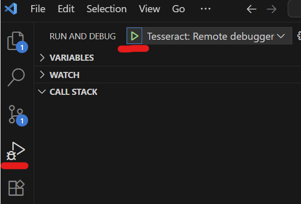

# Advanced usage

## File system I/O

The `tesseract` command can take care of
passing data from local disk
(or any [fsspec-compatible](https://filesystem-spec.readthedocs.io/en/latest/) resource,
like HTTP, FTP, S3 Buckets, and so on) to a Tesseract via the `@` syntax.

If you want to write the output of a Tesseract to a file,
you can use the `--output-path` parameter, which also supports any
[fsspec-compatible](https://filesystem-spec.readthedocs.io/en/latest/)
target path:

```bash
$ tesseract run vectoradd apply --output-path /tmp/output @inputs.json
```

## Using GPUs

To leverage GPU support in your Tesseract environment, you can specify which NVIDIA GPU(s) to make available
using the `--gpus` argument when running a Tesseract command. This allows you to select specific GPUs or
enable all available GPUs for a task.

To run Tesseract on a specific GPU, provide its index:
```bash
$ tesseract run --gpus 0 helloworld apply '{"inputs": {"name": "Osborne"}}'
```

To make all available GPUs accessible, use the `--gpus all` option:
```bash
$ tesseract run --gpus all helloworld apply '{"inputs": {"name": "Osborne"}}'
```

You can also specify multiple GPUs individually:
```bash
$ tesseract run --gpus 0 --gpus 1 helloworld apply '{"inputs": {"name": "Osborne"}}'
```

The GPUs are indexed starting at zero with the same convention as `nvidia-smi`.

## Debug mode

`tesseract serve` supports a `--debug` flag; this has two effects:
  *  Tracebacks from execution are returned in the response body, instead of a generic 500 error.
     This is useful for debugging and testing, but unsafe for production environments.
  *  Aside from listening to the usual Tesseract requests, a debugpy server is also started in
     the container, and the port it's listening to is forwarded to some free port on the host which
     is displayed in the cli when spinning up a tesseract via `tesseract serve`. This allows you to perform
     remote debugging sessions.

In particular, if you are using VScode, here is a sample launch config to attach to a running Tesseract in
debug mode:
```json
        {
            "name": "Tesseract: Remote debugger",
            "type": "debugpy",
            "request": "attach",
            "connect": {
                "host": "localhost",
                "port": "PORT_NUMBER_HERE"
            },
            "pathMappings": [
                {
                    "localRoot": "${workspaceFolder}/examples/helloworld",
                    "remoteRoot": "/tesseract"
                }
            ],
        },
```
(make sure to fill in with the actual port number). After inserting this into the `configurations`
field of your `launch.json` file, you should be able to attach to the Tesseract being served by clicking on the
green "play" button at the top left corner of the "Run and Debug" tab.



For more information on the VSCode debugger, see [this guide](https://code.visualstudio.com/docs/debugtest/debugging).
