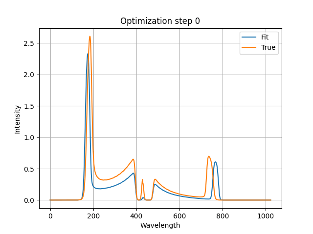

# TSADAR Tesseract

TSADAR is a package for Thomson Scattering analysis developed by Ergodic LLC in collaboration with LLE and UR.

The Thomson Scattering diagnostic is used to infer plasma conditions in fusion-relevant experiments at LLE, ZAP Energy, among others. It is a model-based diagnostic
where the forward model is capable of describing the measured signal relatively accurately. There are some additional transformations that are specific to the device on which and facility where the measurement is being performed.

In this example, we show how to build a Tesseract that wraps the TSADAR package, and then how to use that Tesseract to fit some data using a gradient-based fitting approach. This particular example uses the L-BFGS-B algorithm implemented in `scipy.optimize.minimize`.

## The TSADAR Tesseract

In the file `tesseract_api.py´ we define the endpoints of this tesseract,

## Build
`tesseract --loglevel debug  build . --tag 0.0.1`

## Serve
`tesseract serve tsadaract:0.0.1`

## Use
`python3 fitter.py`

## Citation
1. Milder, A. L., Joglekar, A. S., Rozmus, W. & Froula, D. H. Qualitative and quantitative enhancement of parameter estimation for model-based diagnostics using automatic differentiation with an application to inertial fusion. Mach. Learn.: Sci. Technol. 5, 015026 (2024).
