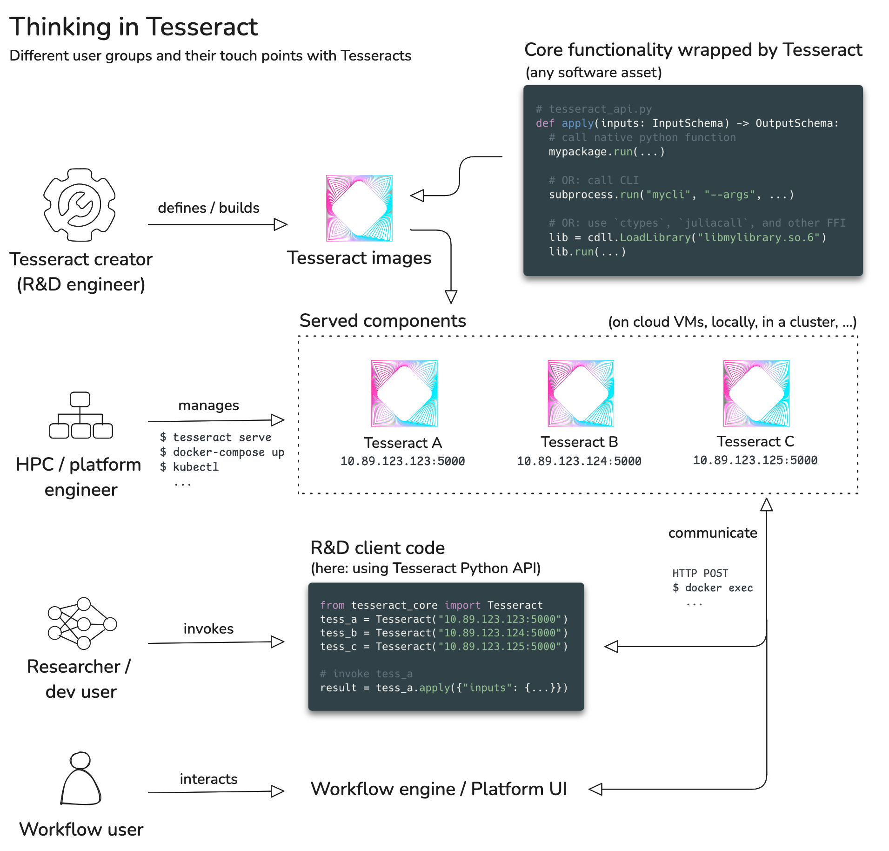
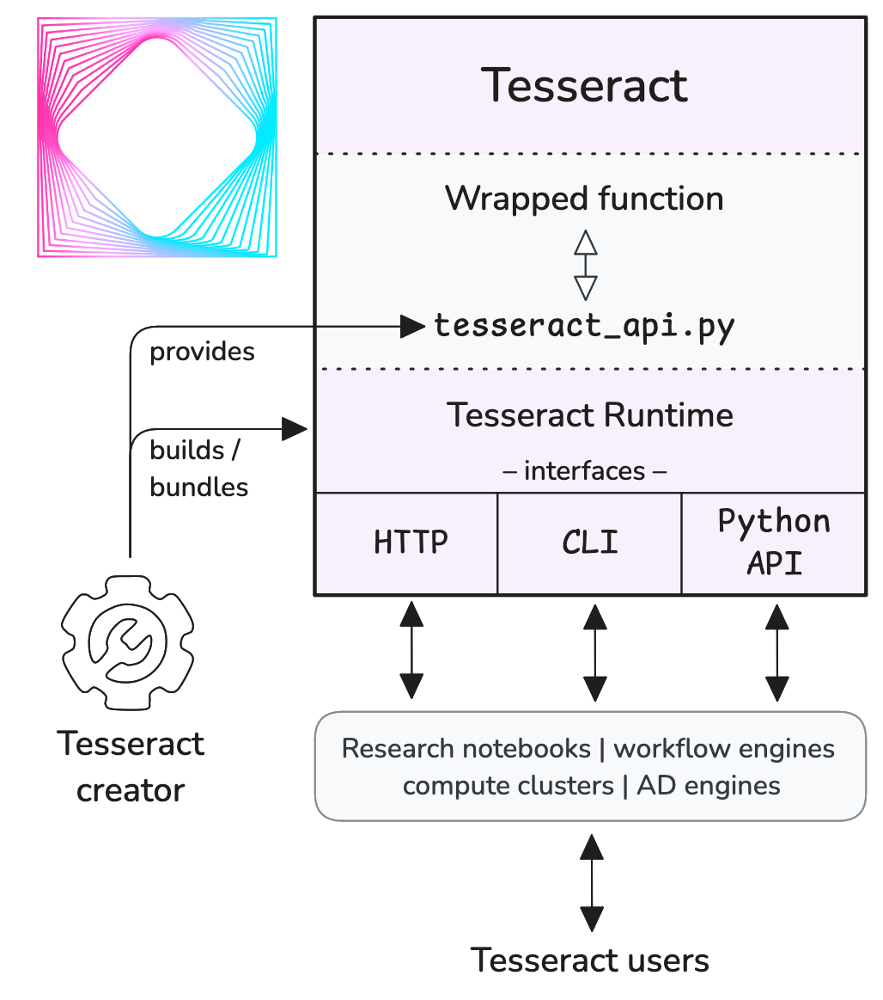

# Summary

Tesseracts are universal software components for scientific computing, simulation, and machine learning (ML), summarized as "simulation intelligence" (SI) [@lavin-si]. Specifically, Tesseracts enable and expedite the transition from experimental, research-grade software to production environments. This includes native support for automatic differentiation between heterogeneous software artifacts in distributed and cloud contexts, which enables end-to-end differentiable programming, hybrid ML and simulation systems, and more for SI at scale.

Tesseract Core is a Python library that serves as the reference implementation for defining, containerizing, executing, and deploying Tesseract components. It provides user entry points to wrap existing software artifacts such as Python functions, Julia code, C++ libraries, or remote services into Tesseract components. By unambiguously defining allowed inputs and outputs of each Tesseract via Pydantic models [@pydantic], Tesseract Core enables external data validation and auto-generation of machine-readable API schemas. This allows users to explore the capabilities of Tesseract components without interacting with code, and enables workflow engines to compose them into larger, self-validating pipelines that are, by the virtue of implementing Tesseracts, end-to-end differentiable. Tesseract components are built to be deployed in distributed contexts, including support for containerization and remote procedure calls (RPC) via network.

# Statement of need

The last few years have seen a rapid increase in the use of machine learning and data-driven methods within scientific computing and industrial simulation. However, when moving beyond the research lab and into real-world engineering workflows, the gap between (GPU-accelerated, autodiff-native, high-level, bare-bones) research code and (CPU-bound, non-differentiable, low-level, feature-rich) production code is often too large to bridge. Similar issues arise when integrating components of different software stacks (e.g., Python, Julia, C++), and when deploying components in heterogeneous or distributed environments (e.g., cloud vs. on-prem, high-performance computing (HPC), and supercomputers).

These software bottlenecks translate to significant untapped potential of differentiable programming in particular and simulation intelligence in general---for example, when exploring the merits of hybrid AI-simulator systems in differentiable physics contexts [@neuralgcm;@solverintheloop;@diffphys], or when using machine learning to augment existing simulation codes [@closure1;@closure2].

Tesseract Core remediates these bottlenecks and elevates integration possibilities by acting as glue between several user groups (\autoref{fig:user-groups}):

{ width=90% }

1. **Researchers** building multi-component systems and experiment pipelines: Tesseract Core provides consistent interfaces to interact with any Tesseract component in the same way. This allows users to discover and download existing Tesseract containers, lowering the bar for researchers to experiment with many different components when developing *systems* rather than single *operations*.

2. **R&D software engineers** building research tools and packaging them: Tesseracts are defined via a Python-based interface with minimal configuration. Users specify input/output schemas for each Tesseract, enabling transparent I/O validation, automatic differentiation, and remote execution behind a unified interface. Tesseract Core provides the tools to validate and build Docker containers from Tesseract definitions.

3. **Platform and HPC engineers** building SI workloads at scale: Tesseracts can be executed in any environment that supports the Tesseract runtime. This allows them to be embedded into virtually any orchestration framework and executed on bare metal, in the cloud, or on compute clusters. Tesseracts expose their input/output schemas according to the machine-readable OpenAPI format, facilitating automated integration into external workflows engines.

This is a markedly different scope than what is found in existing software solutions, which typically focus on a single aspect of the problem space---such as containerization (e.g., Docker, Singularity), remote procedure calls (e.g., gRPC), automatic differentiation (e.g., JAX, PyTorch), and container orchestration (e.g., Kubernetes, Docker Compose)---or are geared towards specific use cases, like Gymnasium [@brockman2016openai] for reinforcement learning, or UM-Bridge [@seelinger2023bridge] for probabilistic programming and HPC. Tesseract Core aims to unify the most valuable parts of these aspects into a single, coherent ecosystem that makes it easy to use and deploy SI methods across different environments.

Concretely, Tesseract Core addresses many of the fundamental issues that arise when building real-world SI systems, including but not limited to:

- **Code sharing** -- How do I make my research-grade simulation code available to other users who are not familiar with the codebase?
- **Reproducibility** -- How can I ensure that my simulation code is executed in a consistent and reproducible manner, regardless of the environment?
- **Streamlined experimentation** -- How can I experiment with different 3rd party simulators, differentiable meshing routines, or ML models without having to install all their dependencies or study their documentation in depth?
- **Dependency management** -- How do I resolve conflicts between different software or hardware requirements of components working together in a pipeline?
- **Remote execution** -- How do I execute my SciML software on a cloud VM and query it from my local machine?
- **Explicit interfaces** -- How do I discover at a glance which parameters of a software branded as "differentiable simulator" are differentiable and which are not?
- **Distributed differentiable programming** -- How do I propagate gradients end-to-end through complex pipelines mixing torch, JAX, and Julia code?

Specific end-to-end examples that leverage the Tesseract ecosystem to address these issues in research and engineering settings are highlighted and continuously published in the [Tesseract community showcase](https://si-tesseract.discourse.group/c/showcase).

# Software design

{ width=50% }

A Tesseract is any object that is served behind the Tesseract runtime, which ships with Tesseract Core and bundles a command-line interface (CLI), Python API, and REST API. Each of these external interfaces maps to the same internal code path, which ultimately invokes a `tesseract_api.py` Python module, provided by the Tesseract creator (\autoref{fig:tess-interfaces}).

The structure of `tesseract_api.py` (and thus the Tesseract interface itself) is centered around a functional programming style without internal state. Specifically, this means that each Tesseract is assumed to wrap a single operation (`apply`) that takes a set of (arbitrarily nested) inputs and produces a set of outputs. All other Tesseract endpoints like `jacobian`, `abstract_eval`, or `vector_jacobian_product` represent transformations of the `apply` function. This is strongly inspired by JAX primitives [@jax2018github], and enables the efficient use of automatic differentiation (AD) techniques such as reverse-mode AD and forward-mode AD [@autodiff], invoked manually or through existing AD engines (\autoref{fig:tess-pipeline}).

{ width=85% }

These methods and the myriad scenarios in which they can be applied continue to be real-world validated in diverse scientific contexts, engineering physics applications, and industrial simulation environments. Progress in these areas and more can be found in the Tesseract open-source community, at [https://si-tesseract.discourse.group](https://si-tesseract.discourse.group).

<!--
# Mathematics

Single dollars ($) are required for inline mathematics e.g. $f(x) = e^{\pi/x}$

Double dollars make self-standing equations:

$$\Theta(x) = \left\{\begin{array}{l}
0\textrm{ if } x < 0\cr
1\textrm{ else}
\end{array}\right.$$

You can also use plain \LaTeX for equations
\begin{equation}\label{eq:fourier}
\hat f(\omega) = \int_{-\infty}^{\infty} f(x) e^{i\omega x} dx
\end{equation}
and refer to \autoref{eq:fourier} from text.

# Citations

Citations to entries in paper.bib should be in
[rMarkdown](http://rmarkdown.rstudio.com/authoring_bibliographies_and_citations.html)
format.

If you want to cite a software repository URL (e.g. something on GitHub without a preferred
citation) then you can do it with the example BibTeX entry below for @fidgit.

For a quick reference, the following citation commands can be used:
- `@author:2001`  ->  "Author et al. (2001)"
- `[@author:2001]` -> "(Author et al., 2001)"
- `[@author1:2001; @author2:2001]` -> "(Author1 et al., 2001; Author2 et al., 2002)"

# Figures

Figures can be included like this:

and referenced from text using \autoref{fig:example}.

Figure sizes can be customized by adding an optional second parameter:
{ width=20% }

# Acknowledgements

We acknowledge contributions from Brigitta Sipocz, Syrtis Major, and Semyeong
Oh, and support from Kathryn Johnston during the genesis of this project.
-->

# References
